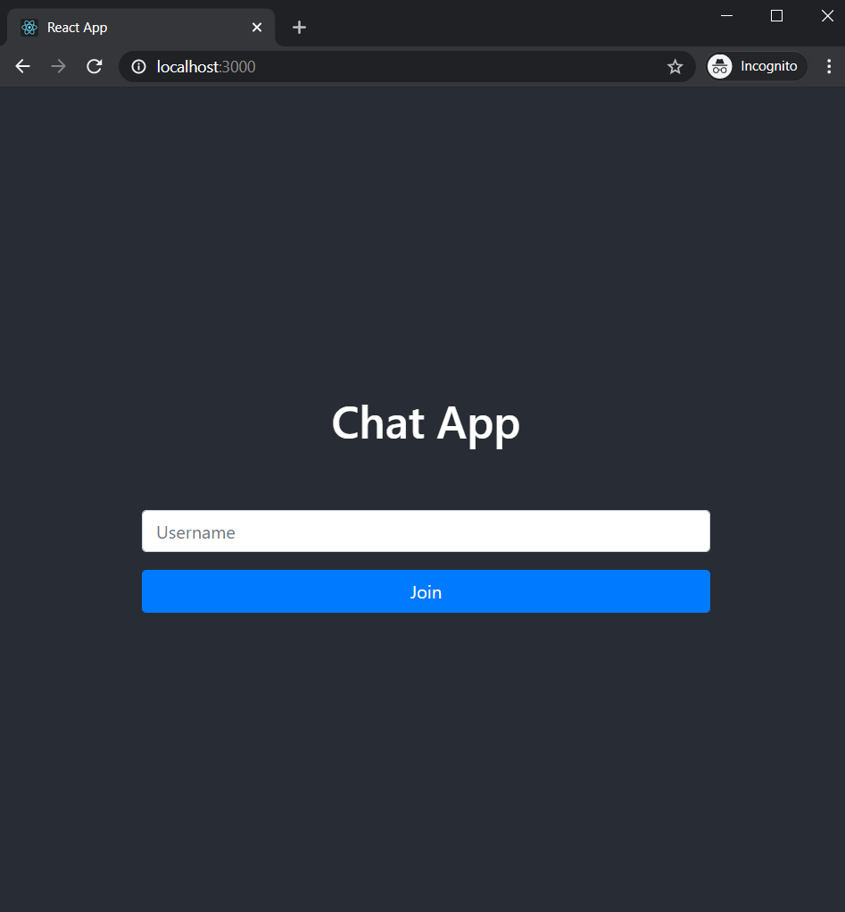
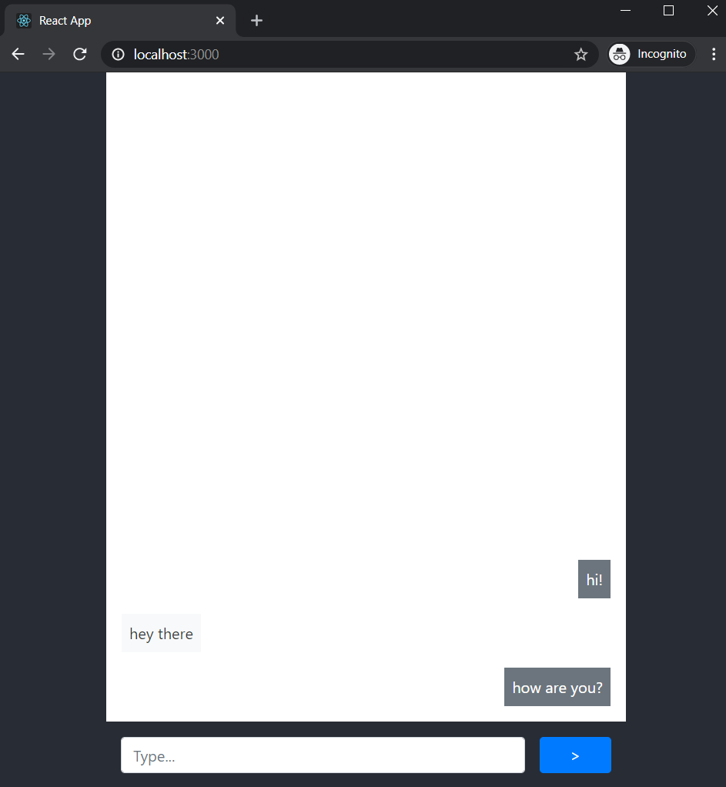

# Chat Example

A simple chat demo using multiple Socket.IO servers

## Features

- Multiple users can join by entering an username
on website load
- Users can type chat messages

## Built with

[Redis Cluster](https://github.com/Grokzen/docker-redis-cluster)

[Traefik](https://traefik.io)

Server

* [Express](https://expressjs.com)
* [Socket.IO](https://socket.io)
* [Redis](https://redis.io)
* [Joi](https://github.com/sideway/joi)
* [Winston](https://github.com/winstonjs/winston)

Web

* [React](https://reactjs.org)
* [Socket.IO Client](https://socket.io)
* [React Bootstrap](https://react-bootstrap.github.io)

## Environment Variables

#### Server

| Variable       | Default               | Type                 | Desc                                           | Example                              |
| -------------- | --------------------- | -------------------- | ---------------------------------------------- | ------------------------------------ |
| DEBUG          | ---                   | string               | node.js debugging utility                      | socket.io:server*                    |
| NODE_ENV       | development           | string               | can be "production" or "development" or "test" | development                          |
| PORT           | 3001                  | number               | server/listening port                          | 3001                                 |
| REDIS_HOSTS    | ---                   | json array as string | redis cluster host/port list                   | '[{"host":"localhost","port":6101}]' |
| REDIS_PASSWORD | ---                   | string               | redis cluster password                         | pwd                                  |
| HOSTNAME       | APP_DEFAULT           | string               | OS or Container hostname                       | MY_PC                                |
| CORS_ORIGIN    | http://localhost:3000 | string               | web app url                                    | http://localhost:3000                |


#### Web

| Variable                  | Default | Type   | Desc                   | Example               |
| ------------------------- | ------- | ------ | ---------------------- | --------------------- |
| REACT_APP_SOCKET_ENDPOINT | ---     | string | socket server endpoint | http://localhost:3001 |

## How to use

```
$ docker-compose up --scale socket-server=3 -d
```

It starts Redis cluster, Traefik for reverse-proxy, web app and 3 socket.io servers.

And point your browser to http://localhost:3000.

## Screenshot

|                                |                        |
| :----------------------------: | :--------------------: |
|  |  |